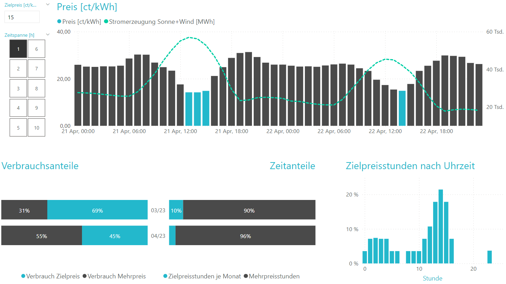
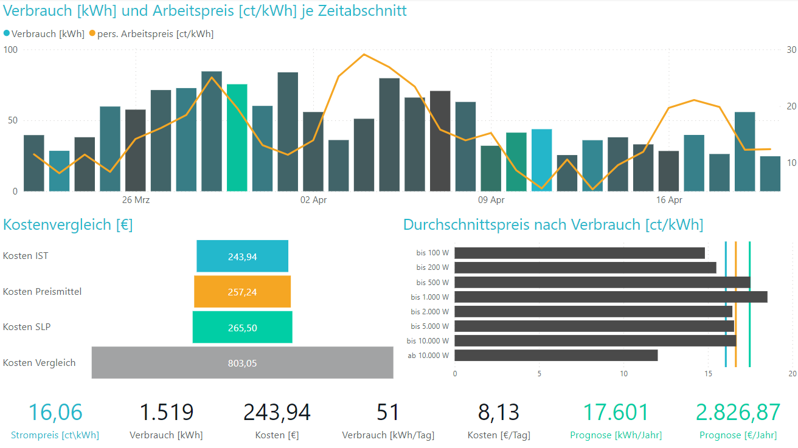
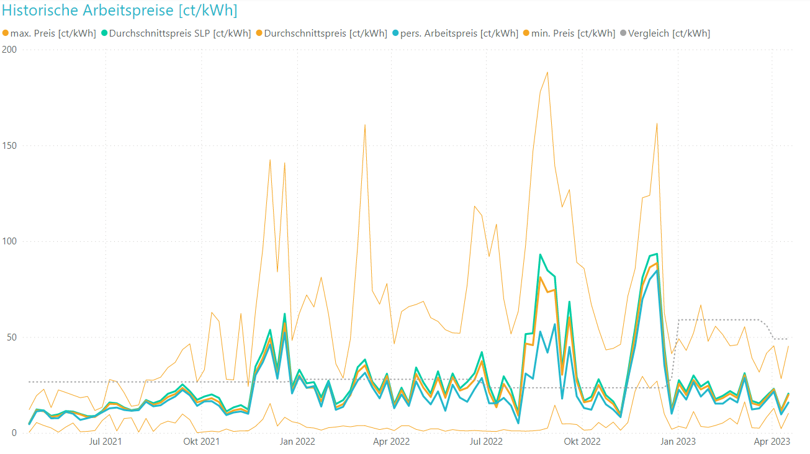
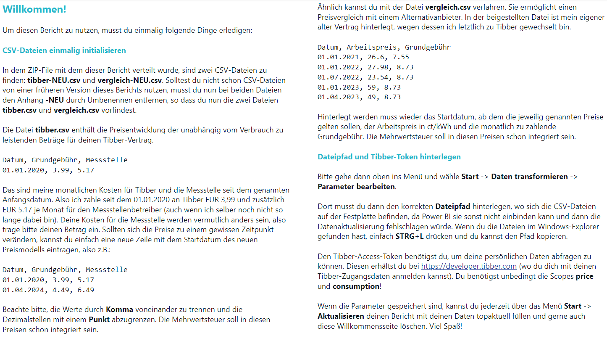

# Tibber Power BI Report

Dieses Repository enthält einen Power BI-Bericht für Tibber-Nutzer.

Power BI Desktop ist ein kostenloses Datenanalyse-Tool von Microsoft. Du kannst es im Microsoft Store auf Windows-Geräten herunterladen und verwenden. Wenn du Power BI Desktop installiert und einen Tibber-Access-Token auf https://developer.tibber.com generiert hast (kostenlos für Tibber-Kunden), kannst du diesen Power BI-Bericht verwenden.

## Download

Lade den Power BI-Bericht für Tibber hier herunter:
- https://github.com/cddbldot/tibber.pbix/releases

## Berichte

Folgende Berichte sind verfügbar:

1. [Aktuelle Preise](#aktuelle-preise)
2. [Verbrauchsstatistik](#verbrauchsstatistik)
3. [Preishistorie](#preishistorie)

### Aktuelle Preise

- Aktuelle Tibber-Preise für heute und ab ca. 13 Uhr für morgen.
- Prognostizierte Stromerzeugung (ab ca. 18 Uhr für den morgigen Tag).
- Zielpreis, Verbrauchsanteile und Zeitanteile.
- Durchschnittspreise für ausgewählte Zeitspannen.
- Zielpreisstunden nach Uhrzeit.

### Verbrauchsstatistik

- Verbrauch und effektiv bezahlter Preis im Zeitverlauf.
- Kostenvergleich: IST-Kosten, Kosten SLP, Vergleichskosten.
- Durchschnittspreis nach Verbrauch.
- Statistische Daten: realisierter Arbeitspreis, Verbrauch und Kosten im Zeitraum und pro Tag, prognostizierte Jahreswerte über SLP.
- Vorbereitete Zeiträume: 7 Tage, 30 Tage, 365 Tage, Freier Zeitraum (benutzerdefiniert).

### Preishistorie

- Persönlicher Arbeitspreis im Zeitverlauf, verglichen mit anderen verfügbaren Preisen.
- Darstellung kann auf Stunde/Tag/Woche/Monat geändert werden.

## Ersteinrichtung

Die Anleitung zur Ersteinrichtung des Berichts findest du auf der Willkommensseite.

Viel Spaß beim Verwenden des Tibber Power BI-Berichts!
